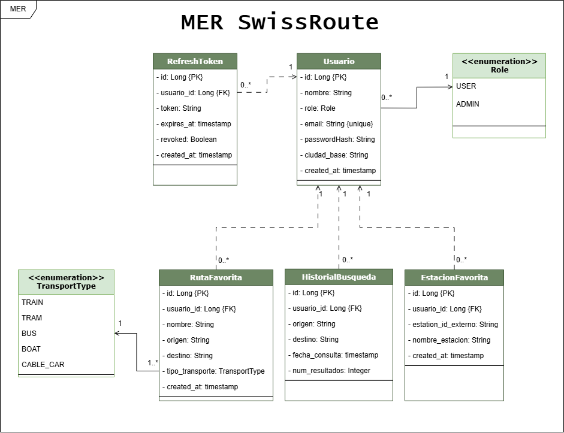

# 🚆 SwissRoute Backend

REST API backend para planificación y seguimiento de viajes en transporte público suizo, construida con Java 17 + Spring Boot 3 + PostgreSQL.

---

## 👥 Equipo de desarrollo

| Usuario | GitHub |
|---|---|
| Yamil | [@dazayamil](https://github.com/dazayamil) |
| Aldar | [@aldar1](https://github.com/aldar1) |
| Jose Gabriel | [@JoseGabriel391](https://github.com/JoseGabriel391) |
| Tomadin | [@Tomadin](https://github.com/Tomadin) |

---

## 🛠 Stack tecnológico

| Capa | Tecnología |
|---|---|
| Lenguaje | Java 17 |
| Framework | Spring Boot 3 |
| Base de datos | PostgreSQL |
| ORM | Spring Data JPA / Hibernate |
| Cliente HTTP | WebClient (WebFlux) |
| Documentación | Swagger / OpenAPI |
| Build tool | Maven |

---

## 📋 Requisitos previos

Antes de ejecutar el proyecto asegurate de tener instalado:

- [Java 17+](https://adoptium.net/)
- [Maven 3.8+](https://maven.apache.org/)
- [PostgreSQL 12+](https://www.postgresql.org/)
- [Git](https://git-scm.com/)

---

## ⚙️ Instalación y configuración

### 1. Clonar el repositorio

```bash
git clone https://github.com/dazayamil/swissroute-backend.git
cd swissroute-backend
```

### 2. Crear la base de datos en PostgreSQL

Conectate a PostgreSQL y ejecutá los siguientes comandos:

```sql
CREATE DATABASE swissroute_db;
CREATE USER swissroute_user WITH PASSWORD 'tu_password';
GRANT ALL PRIVILEGES ON DATABASE swissroute_db TO swissroute_user;
```

### 3. Configurar las variables de entorno

Crear un archivo `.env` en la raíz del proyecto (este archivo **no se sube al repositorio**):

```env
DB_USERNAME=swissroute_user
DB_PASSWORD=tu_password
```

> Podés usar el archivo `.env.example` como referencia.

### 4. Ejecutar el proyecto

```bash
mvn spring-boot:run
```

La aplicación arranca en `http://localhost:8080`

---

## 📁 Estructura del proyecto

```
swissroute-backend/
├── src/
│   └── main/
│       ├── java/com/swissroute/backend/
│       │   ├── config/          ← Configuraciones (WebClient, Swagger, Security)
│       │   ├── controller/      ← REST Controllers
│       │   ├── dto/
│       │   │   ├── request/     ← DTOs de entrada
│       │   │   └── response/    ← DTOs de salida
│       │   ├── entity/          ← Entidades JPA
│       │   ├── exception/       ← Excepciones personalizadas
│       │   ├── repository/      ← Interfaces JPA Repository
│       │   └── service/         ← Lógica de negocio
│       └── resources/
│           └── application.properties
├── .env.example
├── .gitignore
├── pom.xml
└── README.md
```

---

## 🗺 Modelo entidad-relación (MER)

<p align="center">
  
</p>

---

## 🗃 Modelo de base de datos

| Tabla | Descripción |
|---|---|
| `usuarios` | Registro e información de usuarios |
| `rutas_favoritas` | Rutas guardadas por cada usuario |
| `historial_busquedas` | Historial de conexiones consultadas |
| `estaciones_favoritas` | Estaciones marcadas como favoritas |

---

## 🌐 API externa utilizada

Este proyecto consume la **Swiss Public Transport API**:

- Documentación: [transport.opendata.ch/docs.html](https://transport.opendata.ch/docs.html)
- Base URL: `https://transport.opendata.ch/v1`

| Endpoint externo | Uso |
|---|---|
| `/locations` | Búsqueda de estaciones |
| `/connections` | Consulta de conexiones entre estaciones |
| `/stationboard` | Tablón de horarios de una estación |

---

## 📌 Funcionalidades

- 👤 Gestión de usuarios (registro e inicio de sesión)
- 🔍 Búsqueda de estaciones por nombre o coordenadas GPS
- 🗓 Consulta de conexiones entre estaciones con filtros
- 📌 CRUD de rutas favoritas
- 📋 Historial de búsquedas persistido
- 🚉 Tablón de horarios por estación
- ⭐ CRUD de estaciones favoritas

---

## 📄 Documentación API

Con el proyecto corriendo, accedé a Swagger en:

```
http://localhost:8080/swagger-ui.html
```

---

## 🌿 Estrategia de ramas

| Rama | Propósito |
|---|---|
| `main` | Código estable y funcional |
| `develop` | Integración continua del equipo |
| `feature/nombre` | Desarrollo de cada funcionalidad |

---
